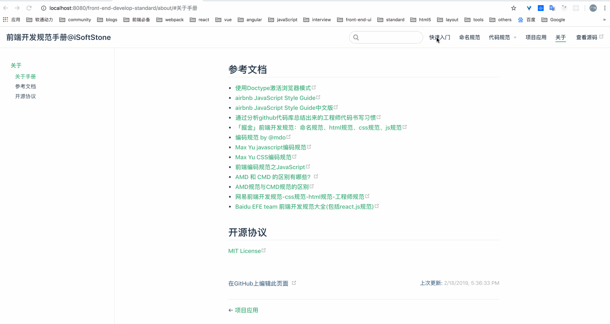

# 快速入门

> 不以规矩，不能成方圆。 对于团队而言，统一很重要，代码是写给人看的，然后顺便跑在机器上而已。

## 有过忧虑吗

你是不是总是在抱怨项目组的各方面不统一，不好维护，千奇百怪？

你是不是每次提交代码的时候总要拉某某人过来看下各种冲突？

你是不是每次merge代码的时候总要话很长的时间去解决不同格式的代码冲突？

你是不是有时候为了解决一个bug好几天没睡好，最终定位的问题也许是一个分号、或是书写规范？ 人人都在恐慌，人人都在责怪他人，但殊不知，换了好几个项目都是类似，想过为什么吗？

## 规范的意义

每一种事物都有它被发明时，都会有其用处和目的，每一个事物都是自己擅长和适合的领域； 我们要在对的地方使用它，让它做自己擅长的事。

- 规范的代码可以促进团队合作；
- 规范的代码可以减少bug处理；
- 规范的代码可以降低维护成本；
- 规范的代码有助于代码审查；
- 养成代码规范的习惯，有助于程序员自身的成长；

## 规范的目的

我们知道，当一个团队开始指定并实行编码规范的话，错误就会变得更加显而易见。 如果一段特定的代码不符合规范的话，它有可能只是代码风格错误，而也有可能会是 bug。 早期指定规范就使得代码审核得以更好的开展，并且可以更精确的地定位到错误。 只要开发者们能够保证源代码源文件都严格遵循规范，那接下去所使用的混淆、压缩和编译工具则可投其所好不尽相同。 为了提高工作效率，便于后台人员添加功能及前端后期优化维护，输出高质量的文档。 在项目构建中，使结构更加清晰，代码简明有序，有一个更好的前端架构。

## 介绍

工程架构基于 `vuepress` 搭建而成，源码地址<https://github.com/niceboybao/front-end-develop-standard>，如有问题请点击[New Issue](https://github.com/niceboybao/front-end-develop-standard/issues)，欢迎 `push` 相关内容加入贡献者行列，要是觉得文档还能凑合着看，欢迎 `star` ~

文档编写参考[airbnb JavaScript样式指南](https://github.com/airbnb/javascript)、[网易前端开发规范-css规范-html规范-工程师规范](http://nec.netease.com/standard)、[Baidu EFE team 前端开发规范大全(包括react.js规范)](https://github.com/ecomfe/spec)、等多个热门的前端开源规范参考,并结合个人项目总结而成。项目 `快速预览图` 如下：

